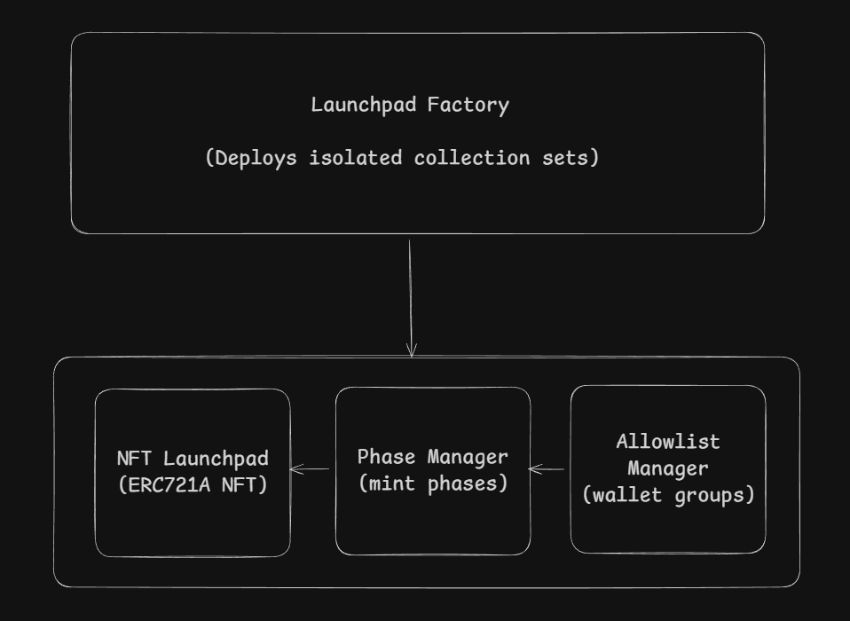

# NFT Launchpad Smart Contract System

A production-grade, modular ERC721A NFT Launchpad system with comprehensive features for phase-based minting, Merkle-tree allowlists, airdrops, revenue splitting, and factory deployment.

## Table of Contents

- [Overview](#overview)
- [Architecture](#architecture)
- [Contracts](#contracts)
  - [NFTLaunchpad](#1-nftlaunchpadsol)
  - [PhaseManager](#2-phasemanagersol)
  - [AllowlistManager](#3-allowlistmanagersol)
  - [LaunchpadFactory](#4-launchpadfactorysol)
  - [SimpleProxy](#5-simpleproxysol)
- [Tech Stack](#tech-stack)
- [Quick Start](#quick-start)
- [Deployment](#deployment)
- [Security](#security)
- [Gas Estimates](#gas-estimates)
- [License](#license)

---

## Overview

This system provides a complete NFT launchpad solution with:

- **ERC721A** - Gas-efficient batch minting (~2000 gas saved per mint)
- **Modular Architecture** - Separated concerns across multiple contracts
- **Phase-Based Minting** - Multiple sale phases with time windows, pricing, and supply caps
- **Merkle Tree Allowlists** - Gas-efficient verification for large allowlists
- **Wallet Groups** - VIP, Whitelist, Team tiers with custom pricing
- **Per-Wallet Overrides** - Individual pricing and mint limits
- **Buy X Get Y** - Promotional bonus mints (e.g., "Buy 3 Get 1 Free")
- **Airdrops** - Batch mint to multiple wallets
- **Revenue Splitting** - Multiple payout wallets with percentage splits
- **Metadata & Reveal** - Placeholder -> Reveal -> Lock system
- **ERC2981 Royalties** - On-chain royalty standard
- **Factory Deployment** - Deploy isolated collections with one transaction
- **Upgradeable** - Proxy pattern support

---

## Architecture



**Data Flow:**
1. AllowlistManager stores wallet groups and Merkle roots
2. PhaseManager validates eligibility via AllowlistManager
3. NFTLaunchpad orchestrates minting via PhaseManager
4. LaunchpadFactory deploys all three as connected proxies

---

## Contracts

### 1. NFTLaunchpad.sol

**Purpose:** Core ERC721A NFT contract implementing the launchpad with modular architecture, supporting multiple phases, allowlists, royalties, and revenue distribution.

**Inheritance:**
- `Initializable` (OpenZeppelin Upgradeable)
- `ERC721AUpgradeable` (ERC721A)
- Implements `ERC2981` (Royalty Standard)

#### State Variables

| Variable | Type | Description |
|----------|------|-------------|
| `maxSupply` | `uint256` | Maximum total NFTs that can be minted |
| `baseTokenURI` | `string` | Base URI for revealed metadata |
| `placeholderURI` | `string` | URI for unrevealed metadata |
| `revealed` | `bool` | Whether metadata has been revealed |
| `metadataLocked` | `bool` | Permanent lock flag for metadata |
| `phaseManager` | `PhaseManager` | Reference to phase management contract |
| `allowlistManager` | `AllowlistManager` | Reference to allowlist contract |
| `payoutWallets` | `PayoutWallet[]` | Array of revenue distribution recipients |
| `totalRevenue` | `uint256` | Total ETH collected from mints |
| `withdrawnRevenue` | `uint256` | Total ETH already withdrawn |
| `paused` | `bool` | Contract pause status |
| `transfersEnabled` | `bool` | Whether transfers are allowed |
| `burnEnabled` | `bool` | Whether burning is allowed |
| `royaltyReceiver` | `address` | ERC2981 royalty recipient |
| `royaltyBps` | `uint96` | Royalty basis points (0-10000) |
| `MAX_AIRDROP_BATCH_SIZE` | `uint256` | Constant: 200 |

#### Structs

```solidity
struct PayoutWallet {
    address wallet;          // Recipient address
    uint256 sharePercentage; // Share out of 10000 (100%)
}
```

#### Functions

##### Initialization

| Function | Parameters | Access | Description |
|----------|-----------|--------|-------------|
| `initialize` | `name_: string, symbol_: string, maxSupply_: uint256, royaltyReceiver_: address, royaltyBps_: uint96, phaseManager_: address, allowlistManager_: address` | External | Initialize the NFT contract with name, symbol, supply, royalties, and manager references |

##### Minting Functions

| Function | Parameters | Access | Description |
|----------|-----------|--------|-------------|
| `mint` | `quantity: uint256, phaseId: uint256` | External Payable | Mint NFTs during an active phase. Validates eligibility, enforces limits, and processes payment |
| `mintWithProof` | `quantity: uint256, phaseId: uint256, merkleProof: bytes32[]` | External Payable | Mint with Merkle proof for allowlist verification. Required for Merkle-based wallet groups |
| `adminMint` | `to: address, quantity: uint256` | External (Owner) | Owner-only mint that bypasses all phases and restrictions. Used for team allocations |
| `airdrop` | `recipients: address[], quantities: uint256[]` | External (Owner) | Batch airdrop to multiple wallets. Max 200 recipients per call |

##### Supply Management

| Function | Parameters | Access | Description |
|----------|-----------|--------|-------------|
| `increaseMaxSupply` | `newMax: uint256` | External (Owner) | Increase the maximum supply. New value must be greater than current max |
| `decreaseMaxSupply` | `newMax: uint256` | External (Owner) | Decrease the maximum supply. Cannot go below already minted amount |

##### Metadata Functions

| Function | Parameters | Access | Description |
|----------|-----------|--------|-------------|
| `setBaseURI` | `newBaseURI: string` | External (Owner) | Set the base URI for revealed metadata. Fails if metadata is locked |
| `setPlaceholderURI` | `uri: string` | External (Owner) | Set the placeholder URI for unrevealed state |
| `reveal` | - | External (Owner) | Switch from placeholder to revealed metadata |
| `lockMetadata` | - | External (Owner) | Permanently lock metadata. IRREVERSIBLE |
| `tokenURI` | `tokenId: uint256` | Public View | Returns token metadata URI. Returns placeholder if not revealed |

##### Revenue Management

| Function | Parameters | Access | Description |
|----------|-----------|--------|-------------|
| `addPayoutWallet` | `wallet: address, sharePercentage: uint256` | External (Owner) | Add a revenue recipient. Share is out of 10000 (100%) |
| `updatePayoutWallet` | `index: uint256, wallet: address, sharePercentage: uint256` | External (Owner) | Update an existing payout wallet |
| `removePayoutWallet` | `index: uint256` | External (Owner) | Remove a payout wallet from the list |
| `withdraw` | - | External (Owner) | Distribute all available balance to payout wallets. Requires total shares = 10000 |
| `getTotalShares` | - | Public View | Returns sum of all share percentages |
| `getPayoutWalletCount` | - | Public View | Returns number of payout wallets |
| `getAvailableBalance` | - | Public View | Returns current contract ETH balance |

##### Access Controls

| Function | Parameters | Access | Description |
|----------|-----------|--------|-------------|
| `pause` | - | External (Owner) | Pause all minting operations |
| `unpause` | - | External (Owner) | Resume minting operations |
| `setTransfersEnabled` | `enabled: bool` | External (Owner) | Enable or disable NFT transfers |
| `setBurnEnabled` | `enabled: bool` | External (Owner) | Enable or disable token burning |
| `burn` | `tokenId: uint256` | External | Burn a token. Caller must own the token and burning must be enabled |

##### Royalty Functions

| Function | Parameters | Access | Description |
|----------|-----------|--------|-------------|
| `setRoyaltyInfo` | `receiver: address, bps: uint96` | External (Owner) | Set ERC2981 royalty receiver and basis points (max 1000 = 10%) |
| `royaltyInfo` | `tokenId: uint256, salePrice: uint256` | Public View | ERC2981: Returns royalty receiver and amount for a sale |
| `supportsInterface` | `interfaceId: bytes4` | Public View | Returns true for ERC721, ERC721Metadata, ERC2981 |

##### Ownership

| Function | Parameters | Access | Description |
|----------|-----------|--------|-------------|
| `transferOwnership` | `newOwner: address` | External (Owner) | Transfer contract ownership |
| `owner` | - | Public View | Returns current owner address |
| `setManagers` | `phaseManager_: address, allowlistManager_: address` | External (Owner) | Update PhaseManager and AllowlistManager references |

##### Delegated View Functions

| Function | Parameters | Returns | Description |
|----------|-----------|---------|-------------|
| `totalMinted` | - | `uint256` | Total NFTs minted so far |
| `isPhaseActive` | `phaseId: uint256` | `bool` | Check if a phase is currently active (delegated to PhaseManager) |
| `isEligibleForPhase` | `wallet: address, phaseId: uint256` | `bool` | Check on-chain eligibility (delegated to PhaseManager) |
| `isEligibleWithProof` | `wallet: address, phaseId: uint256, merkleProof: bytes32[]` | `bool` | Check Merkle eligibility (delegated to PhaseManager) |
| `getPriceForWallet` | `wallet: address, phaseId: uint256` | `uint256` | Get effective mint price (delegated to PhaseManager) |
| `getMaxMintForWallet` | `wallet: address, phaseId: uint256` | `uint256` | Get max mint limit (delegated to PhaseManager) |
| `getRemainingMintsForWallet` | `wallet: address, phaseId: uint256` | `uint256` | Get remaining mints allowed (delegated to PhaseManager) |
| `phaseCount` | - | `uint256` | Total phases created (delegated to PhaseManager) |
| `walletGroupCount` | - | `uint256` | Total wallet groups (delegated to AllowlistManager) |

#### Events

| Event | Parameters | Description |
|-------|-----------|-------------|
| `Minted` | `minter: address, quantity: uint256, phaseId: uint256, totalPaid: uint256` | Emitted on successful mint |
| `AdminMinted` | `to: address, quantity: uint256` | Emitted on admin mint |
| `AirdropExecuted` | `totalWallets: uint256, totalMinted: uint256` | Emitted on airdrop |
| `MaxSupplyUpdated` | `newMaxSupply: uint256` | Emitted when max supply changes |
| `BaseURIUpdated` | `newBaseURI: string` | Emitted when base URI changes |
| `PlaceholderURIUpdated` | `newPlaceholderURI: string` | Emitted when placeholder changes |
| `Revealed` | - | Emitted when metadata is revealed |
| `MetadataLocked` | - | Emitted when metadata is locked |
| `PayoutWalletAdded` | `wallet: address, sharePercentage: uint256` | Emitted when payout wallet added |
| `PayoutWalletUpdated` | `index: uint256, wallet: address, sharePercentage: uint256` | Emitted on payout update |
| `PayoutWalletRemoved` | `index: uint256` | Emitted when payout wallet removed |
| `Withdrawn` | `amount: uint256` | Emitted on revenue withdrawal |
| `Paused` | - | Emitted when contract paused |
| `Unpaused` | - | Emitted when contract unpaused |
| `TransfersToggled` | `enabled: bool` | Emitted when transfers toggled |
| `BurnToggled` | `enabled: bool` | Emitted when burning toggled |
| `RoyaltyInfoUpdated` | `receiver: address, bps: uint96` | Emitted when royalty info changes |
| `OwnershipTransferred` | `previousOwner: address, newOwner: address` | Emitted on ownership transfer |
| `ManagersUpdated` | `phaseManager: address, allowlistManager: address` | Emitted when managers updated |

---

### 2. PhaseManager.sol

**Purpose:** Manages mint phases, pricing tiers, eligibility validation, and phase-based constraints for NFT launches. Handles Buy X Get Y promotions.

**Inheritance:**
- `Initializable` (OpenZeppelin Upgradeable)
- `OwnableUpgradeable` (OpenZeppelin Upgradeable)
- `ReentrancyGuardUpgradeable` (OpenZeppelin Upgradeable)

#### State Variables

| Variable | Type | Description |
|----------|------|-------------|
| `mintPhases` | `mapping(uint256 => MintPhase)` | Storage for all phase configurations |
| `phaseCount` | `uint256` | Total number of phases created |
| `phaseMints` | `mapping(uint256 => mapping(address => uint256))` | Tracks mints per wallet per phase |
| `allowlistManager` | `AllowlistManager` | Reference to allowlist contract |
| `launchpadContract` | `address` | Authorized NFTLaunchpad address |
| `MAX_BONUS_PER_MINT` | `uint256` | Constant: 100 (safety limit for Buy X Get Y) |

#### Structs

```solidity
struct MintPhase {
    string name;           // Phase name (e.g., "VIP Sale", "Public")
    uint256 startTime;     // Unix timestamp for phase start
    uint256 endTime;       // Unix timestamp for phase end
    uint256 price;         // Price per NFT in wei
    uint256 maxSupply;     // Maximum NFTs mintable in this phase
    uint256 minted;        // Count of NFTs minted in this phase
    uint256 maxPerWallet;  // Maximum mints per wallet in this phase
    uint256 walletGroupId; // Associated wallet group (0 = public)
    bool active;           // Whether phase is enabled
    bool buyXGetY;         // Buy X Get Y promotion enabled
    uint256 buyAmount;     // Number to buy (X)
    uint256 getAmount;     // Number of bonus NFTs (Y)
}
```

#### Functions

##### Initialization

| Function | Parameters | Access | Description |
|----------|-----------|--------|-------------|
| `initialize` | `_owner: address, _allowlistManager: address` | External | Initialize with owner and AllowlistManager reference |
| `setLaunchpadContract` | `_launchpad: address` | External (Owner) | Set the authorized NFTLaunchpad contract |
| `setAllowlistManager` | `_allowlistManager: address` | External (Owner) | Update AllowlistManager reference |

##### Phase Management

| Function | Parameters | Access | Description |
|----------|-----------|--------|-------------|
| `createMintPhase` | `name: string, startTime: uint256, endTime: uint256, price: uint256, phaseMaxSupply: uint256, maxPerWallet: uint256, walletGroupId: uint256, buyXGetY: bool, buyAmount: uint256, getAmount: uint256` | External (Owner) | Create a new mint phase with all configuration |
| `updateMintPhase` | `phaseId: uint256, name: string, startTime: uint256, endTime: uint256, price: uint256, phaseMaxSupply: uint256, maxPerWallet: uint256` | External (Owner) | Update existing phase configuration |
| `togglePhase` | `phaseId: uint256` | External (Owner) | Toggle phase active/inactive status |

##### Minting Validation

| Function | Parameters | Access | Description |
|----------|-----------|--------|-------------|
| `validateAndRecordMint` | `phaseId: uint256, wallet: address, quantity: uint256, merkleProof: bytes32[]` | External (Launchpad Only) | Validate eligibility, calculate final quantity with bonuses, record mint, return quantity and price |

##### View Functions

| Function | Parameters | Returns | Description |
|----------|-----------|---------|-------------|
| `isPhaseActive` | `phaseId: uint256` | `bool` | Check if phase is active and within time window |
| `isEligibleForPhase` | `wallet: address, phaseId: uint256` | `bool` | Check on-chain wallet group eligibility |
| `isEligibleWithProof` | `wallet: address, phaseId: uint256, merkleProof: bytes32[]` | `bool` | Check eligibility with Merkle proof |
| `getPriceForWallet` | `wallet: address, phaseId: uint256` | `uint256` | Get effective price (considers wallet overrides) |
| `getMaxMintForWallet` | `wallet: address, phaseId: uint256` | `uint256` | Get effective max mint limit |
| `getRemainingMintsForWallet` | `wallet: address, phaseId: uint256` | `uint256` | Get remaining mints for wallet in phase |
| `getPhase` | `phaseId: uint256` | `MintPhase` | Get full phase configuration struct |
| `getPhaseMintedCount` | `phaseId: uint256` | `uint256` | Get number minted in phase |
| `getPhaseRemainingSupply` | `phaseId: uint256` | `uint256` | Get remaining supply in phase |

#### Events

| Event | Parameters | Description |
|-------|-----------|-------------|
| `PhaseCreated` | `phaseId: uint256, name: string` | Emitted when new phase created |
| `PhaseUpdated` | `phaseId: uint256` | Emitted when phase updated |
| `PhaseToggled` | `phaseId: uint256, active: bool` | Emitted when phase toggled |
| `PhaseMintRecorded` | `phaseId: uint256, wallet: address, quantity: uint256, finalQuantity: uint256` | Emitted on recorded mint |
| `LaunchpadContractUpdated` | `previousLaunchpad: address, newLaunchpad: address` | Emitted when launchpad updated |
| `AllowlistManagerUpdated` | `previousManager: address, newManager: address` | Emitted when manager updated |

---

### 3. AllowlistManager.sol

**Purpose:** Manages wallet groups, allowlists, and Merkle-based eligibility verification for NFT launchpad access control. Supports both on-chain and Merkle tree verification.

**Inheritance:**
- `Initializable` (OpenZeppelin Upgradeable)
- `OwnableUpgradeable` (OpenZeppelin Upgradeable)
- `ReentrancyGuardUpgradeable` (OpenZeppelin Upgradeable)

#### State Variables

| Variable | Type | Description |
|----------|------|-------------|
| `walletGroups` | `mapping(uint256 => WalletGroup)` | Wallet group configurations |
| `walletGroupMembers` | `mapping(uint256 => mapping(address => bool))` | On-chain group membership |
| `walletOverrides` | `mapping(uint256 => mapping(address => WalletOverride))` | Per-wallet custom pricing/limits |
| `walletGroupCount` | `uint256` | Total wallet groups created |
| `walletGroupMerkleRoots` | `mapping(uint256 => bytes32)` | Merkle roots for large allowlists |
| `walletGroupUseMerkle` | `mapping(uint256 => bool)` | Flag for Merkle verification mode |
| `launchpadContract` | `address` | Authorized launchpad contract |
| `phaseManagerContract` | `address` | Authorized phase manager contract |

#### Structs

```solidity
struct WalletGroup {
    string name;            // Group name (e.g., "VIP", "Whitelist")
    uint256 defaultPrice;   // Default mint price for group members
    uint256 defaultMaxMint; // Default max mint limit for group members
    bool active;            // Whether group is enabled
}

struct WalletOverride {
    uint256 customPrice;    // Custom price for specific wallet
    uint256 customMaxMint;  // Custom max mint for specific wallet
    bool hasOverride;       // Whether override is set
}
```

#### Functions

##### Initialization

| Function | Parameters | Access | Description |
|----------|-----------|--------|-------------|
| `initialize` | `_owner: address` | External | Initialize contract with owner |
| `setLaunchpadContract` | `_launchpad: address` | External (Owner) | Set authorized launchpad address |
| `setPhaseManagerContract` | `_phaseManager: address` | External (Owner) | Set authorized phase manager address |

##### Group Creation

| Function | Parameters | Access | Description |
|----------|-----------|--------|-------------|
| `createWalletGroup` | `name: string, defaultPrice: uint256, defaultMaxMint: uint256` | External (Owner) | Create on-chain membership wallet group. Returns `groupId` |
| `createMerkleWalletGroup` | `name: string, defaultPrice: uint256, defaultMaxMint: uint256, merkleRoot: bytes32` | External (Owner) | Create Merkle-based wallet group for large allowlists. Returns `groupId` |

##### Group Management

| Function | Parameters | Access | Description |
|----------|-----------|--------|-------------|
| `updateWalletGroup` | `groupId: uint256, name: string, defaultPrice: uint256, defaultMaxMint: uint256` | External (Owner) | Update group name, price, and limit |
| `toggleWalletGroup` | `groupId: uint256` | External (Owner) | Toggle group active/inactive status |
| `setWalletGroupMerkleRoot` | `groupId: uint256, merkleRoot: bytes32` | External (Owner) | Update Merkle root for a group |

##### Wallet Management

| Function | Parameters | Access | Description |
|----------|-----------|--------|-------------|
| `addWalletsToGroup` | `groupId: uint256, wallets: address[]` | External (Owner) | Batch add wallets to on-chain group |
| `addWalletWithOverride` | `groupId: uint256, wallet: address, customPrice: uint256, customMaxMint: uint256` | External (Owner) | Add wallet with custom pricing and limits |
| `removeWalletFromGroup` | `groupId: uint256, wallet: address` | External (Owner) | Remove wallet from on-chain group |
| `bulkUpdateWallets` | `groupId: uint256, wallets: address[], prices: uint256[], maxMints: uint256[]` | External (Owner) | Batch update wallet overrides |

##### View Functions

| Function | Parameters | Returns | Description |
|----------|-----------|---------|-------------|
| `isWalletInGroup` | `groupId: uint256, wallet: address` | `bool` | Check on-chain group membership |
| `isEligibleWithProof` | `groupId: uint256, wallet: address, merkleProof: bytes32[]` | `bool` | Verify Merkle proof for eligibility |
| `getPriceForWallet` | `groupId: uint256, wallet: address` | `uint256` | Get effective price (default or override) |
| `getMaxMintForWallet` | `groupId: uint256, wallet: address` | `uint256` | Get effective max mint (default or override) |
| `isGroupMerkleBased` | `groupId: uint256` | `bool` | Check if group uses Merkle verification |
| `getWalletGroup` | `groupId: uint256` | `name, defaultPrice, defaultMaxMint, active` | Get group configuration |
| `isGroupActive` | `groupId: uint256` | `bool` | Check if group is active |

#### Events

| Event | Parameters | Description |
|-------|-----------|-------------|
| `WalletGroupCreated` | `groupId: uint256, name: string, isMerkleBased: bool` | Emitted when group created |
| `WalletGroupUpdated` | `groupId: uint256, name: string, defaultPrice: uint256, defaultMaxMint: uint256` | Emitted on group update |
| `WalletsAddedToGroup` | `groupId: uint256, count: uint256` | Emitted when wallets added |
| `WalletRemovedFromGroup` | `groupId: uint256, wallet: address` | Emitted when wallet removed |
| `WalletOverrideSet` | `groupId: uint256, wallet: address, price: uint256, maxMint: uint256` | Emitted on override set |
| `WalletGroupToggled` | `groupId: uint256, active: bool` | Emitted when group toggled |
| `MerkleRootUpdated` | `groupId: uint256, merkleRoot: bytes32` | Emitted when Merkle root updated |
| `LaunchpadContractUpdated` | `previousLaunchpad: address, newLaunchpad: address` | Emitted when launchpad updated |
| `PhaseManagerContractUpdated` | `previousPhaseManager: address, newPhaseManager: address` | Emitted when manager updated |

---

### 4. LaunchpadFactory.sol

**Purpose:** Factory contract for deploying isolated NFT collection contracts with all supporting infrastructure (NFTLaunchpad, PhaseManager, AllowlistManager) as connected proxies in a single transaction.

**Inheritance:**
- `Initializable` (OpenZeppelin Upgradeable)
- `OwnableUpgradeable` (OpenZeppelin Upgradeable)

#### State Variables

| Variable | Type | Description |
|----------|------|-------------|
| `nftLaunchpadImpl` | `address` | Implementation contract for NFTLaunchpad proxies |
| `phaseManagerImpl` | `address` | Implementation contract for PhaseManager proxies |
| `allowlistManagerImpl` | `address` | Implementation contract for AllowlistManager proxies |
| `collections` | `mapping(uint256 => CollectionDeployment)` | Deployed collection records |
| `collectionCount` | `uint256` | Total collections deployed |
| `ownerCollections` | `mapping(address => uint256[])` | Collections by owner address |
| `nftContractToCollectionId` | `mapping(address => uint256)` | Reverse lookup from NFT address to collection ID |

#### Structs

```solidity
struct CollectionDeployment {
    address nftContract;       // Deployed NFTLaunchpad proxy address
    address phaseManager;      // Deployed PhaseManager proxy address
    address allowlistManager;  // Deployed AllowlistManager proxy address
    address owner;             // Collection owner
    uint256 deployedAt;        // Deployment block timestamp
}

struct DeploymentParams {
    string name;               // NFT collection name
    string symbol;             // NFT collection symbol
    uint256 maxSupply;         // Maximum total supply
    address royaltyReceiver;   // ERC2981 royalty recipient
    uint96 royaltyBps;         // Royalty basis points
}
```

#### Functions

##### Initialization

| Function | Parameters | Access | Description |
|----------|-----------|--------|-------------|
| `initialize` | `_owner: address, _nftLaunchpadImpl: address, _phaseManagerImpl: address, _allowlistManagerImpl: address` | External | Initialize factory with implementation addresses |

##### Deployment

| Function | Parameters | Access | Description |
|----------|-----------|--------|-------------|
| `deployCollection` | `params: DeploymentParams` | External | Deploy a new collection with all three contracts as proxies. Returns `collectionId, nftContract, phaseManager, allowlistManager` |

##### Administration

| Function | Parameters | Access | Description |
|----------|-----------|--------|-------------|
| `updateImplementations` | `_nftLaunchpadImpl: address, _phaseManagerImpl: address, _allowlistManagerImpl: address` | External (Owner) | Update implementation contract addresses for future deployments |

##### View Functions

| Function | Parameters | Returns | Description |
|----------|-----------|---------|-------------|
| `getCollection` | `collectionId: uint256` | `CollectionDeployment` | Get full deployment details |
| `getOwnerCollections` | `owner: address` | `uint256[]` | Get all collection IDs owned by address |
| `getCollectionIdByNFT` | `nftContract: address` | `uint256` | Get collection ID from NFT contract address |
| `isDeployedCollection` | `nftContract: address` | `bool` | Verify if NFT was deployed by this factory |

#### Events

| Event | Parameters | Description |
|-------|-----------|-------------|
| `CollectionDeployed` | `collectionId: uint256, owner: address, nftContract: address, phaseManager: address, allowlistManager: address, name: string, symbol: string` | Emitted when collection deployed |
| `ImplementationsUpdated` | `nftLaunchpadImpl: address, phaseManagerImpl: address, allowlistManagerImpl: address` | Emitted when implementations updated |

---

### 5. SimpleProxy.sol

**Purpose:** Minimal wrapper contract providing a compilable ERC1967 proxy for deploying upgradeable contracts.

**Inheritance:**
- `ERC1967Proxy` (OpenZeppelin)

#### Functions

| Function | Parameters | Description |
|----------|-----------|-------------|
| `constructor` | `implementation: address, data: bytes` | Deploy proxy pointing to implementation, optionally calling initializer with data |

---

## Tech Stack

- **Solidity** 0.8.23
- **Hardhat** - Development framework
- **ERC721A Upgradeable** - Gas-optimized NFT standard
- **OpenZeppelin Upgradeable** - Security contracts
- **ThirdWeb** - Deployment tools
- **zkSync Era** - L2 support

---

## Quick Start

```bash
bun install           # Install dependencies
bun run compile       # Compile contracts
bun run test          # Run tests (requires Node.js v22 LTS)
bun run deploy        # Deploy via ThirdWeb
```

## Environment Variables

Create a `.env` file in the root directory:

```env
PRIVATE_KEY=your_wallet_private_key
THIRDWEB_SECRET_KEY=your_thirdweb_secret_key
```

---

## Deployment

### Deploy via Factory (Recommended)

```solidity
// 1. Deploy implementation contracts
NFTLaunchpad nftImpl = new NFTLaunchpad();
PhaseManager phaseImpl = new PhaseManager();
AllowlistManager allowlistImpl = new AllowlistManager();

// 2. Deploy factory
LaunchpadFactory factory = new LaunchpadFactory();
factory.initialize(owner, address(nftImpl), address(phaseImpl), address(allowlistImpl));

// 3. Deploy a collection
LaunchpadFactory.DeploymentParams memory params = LaunchpadFactory.DeploymentParams({
    name: "My NFT Collection",
    symbol: "MNFT",
    maxSupply: 10000,
    royaltyReceiver: royaltyAddress,
    royaltyBps: 500  // 5%
});

(uint256 collectionId, address nft, address phase, address allowlist) = factory.deployCollection(params);
```

### Direct Deployment

```solidity
// Deploy implementations
NFTLaunchpad nft = new NFTLaunchpad();
PhaseManager phase = new PhaseManager();
AllowlistManager allowlist = new AllowlistManager();

// Deploy proxies and initialize
// ... (see scripts/deploy-proxies.js)
```

### Networks Configured

- Hardhat (local)
- zkSync Era Sepolia (testnet)
- zkSync Era Mainnet
- Base Sepolia (testnet)

---

## Usage Examples

### Create a Public Sale Phase

```solidity
PhaseManager(phaseManager).createMintPhase(
    "Public Sale",              // name
    block.timestamp,            // start now
    block.timestamp + 7 days,   // end in 7 days
    0.1 ether,                  // price
    5000,                       // phase supply
    5,                          // max per wallet
    0,                          // 0 = public (no wallet group)
    false,                      // no Buy X Get Y
    0,                          // buyAmount
    0                           // getAmount
);
```

### Create VIP Allowlist with Merkle Tree

```solidity
// Create Merkle-based group (for large allowlists)
uint256 groupId = AllowlistManager(allowlist).createMerkleWalletGroup(
    "VIP",
    0.05 ether,    // discounted price
    10,            // max mint
    merkleRoot     // pre-computed Merkle root
);

// Create VIP-only phase
PhaseManager(phase).createMintPhase(
    "VIP Sale",
    block.timestamp,
    block.timestamp + 1 days,
    0.05 ether,
    1000,
    10,
    groupId,       // wallet group ID
    false, 0, 0
);
```

### Buy 3 Get 1 Free Promotion

```solidity
PhaseManager(phase).createMintPhase(
    "Promo Sale",
    block.timestamp,
    block.timestamp + 3 days,
    0.1 ether,
    2000,
    12,
    0,             // public
    true,          // enable Buy X Get Y
    3,             // buy 3
    1              // get 1 free
);
```

### Setup Revenue Split

```solidity
NFTLaunchpad(nft).addPayoutWallet(teamWallet, 7000);   // 70%
NFTLaunchpad(nft).addPayoutWallet(artistWallet, 2000); // 20%
NFTLaunchpad(nft).addPayoutWallet(devWallet, 1000);    // 10%

// After sales
NFTLaunchpad(nft).withdraw(); // Distributes to all wallets
```

### Reveal Metadata

```solidity
// Before mint - set placeholder
NFTLaunchpad(nft).setPlaceholderURI("ipfs://QmPlaceholder/hidden.json");

// After mint - reveal
NFTLaunchpad(nft).setBaseURI("ipfs://QmRevealed/");
NFTLaunchpad(nft).reveal();

// Optionally lock forever
NFTLaunchpad(nft).lockMetadata();
```

---

## Security

### Implemented Protections

- Reentrancy guards on all payable functions
- Access control via `onlyOwner` modifier
- Launchpad-only modifiers for phase recording
- Custom errors for gas efficiency
- Supply cap enforcement
- Input validation
- Emergency pause mechanism
- Storage gaps for upgrade safety

### Audit Status

- Self-audited
- Recommended: Professional audit before mainnet deployment

### Known Limitations

- On-chain randomness is weak (consider Chainlink VRF for high-value drops)
- Phase start times are public (use wallet groups for truly private sales)

---

## Gas Estimates

| Operation | Estimated Gas |
|-----------|---------------|
| Deploy Factory | ~2,500,000 |
| Deploy Collection (via Factory) | ~1,500,000 |
| Mint 1 NFT | ~80,000 |
| Mint 5 NFTs | ~200,000 |
| Create Phase | ~150,000 |
| Create Wallet Group | ~100,000 |
| Add 10 Wallets | ~200,000 |
| Withdraw | ~100,000 |

---

## Testing

```bash
# Requires Node.js v22 LTS
nvm use 22
bun run test
```

Test coverage includes:
- Initialization
- Minting (public, admin, airdrop, with proof)
- Phase management
- Wallet groups & overrides
- Merkle verification
- Revenue distribution
- Metadata & reveal
- Access controls
- Factory deployment

---

## Project Structure

```
nft-marketplace-contract/
├── contracts/
│   ├── NFTLaunchpad.sol        # Core ERC721A NFT contract
│   ├── PhaseManager.sol        # Phase management
│   ├── AllowlistManager.sol    # Allowlist & Merkle verification
│   ├── LaunchpadFactory.sol    # Factory for deployments
│   └── SimpleProxy.sol         # ERC1967 proxy wrapper
├── scripts/
│   ├── deploy-factory.js       # Factory deployment
│   ├── deploy-implementations.js
│   ├── deploy-proxies.js
│   └── verify-contracts.js
├── test/
│   └── NFTLaunchpad.test.js
├── hardhat.config.js
└── package.json
```

---

## Scripts

| Command | Description |
|---------|-------------|
| `bun run compile` | Compile contracts |
| `bun run test` | Run tests |
| `bun run deploy` | Deploy via ThirdWeb |

---

## License

MIT
